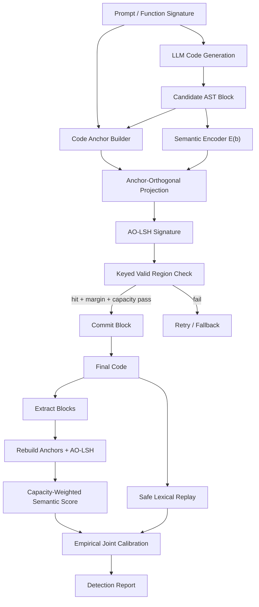

# CASD-WFCLLM 修复方案文档

**日期：** 2026-06-02  
**状态：** 条件性修复方案；必须先完成 Anchor 有效性验证，达到 GO gate 后再进入实现  
**范围：** 修复 `WFCLLM` 当前生成时代码水印在低熵代码生成中的语义信道失效、词法信道风险和联合检测校准问题  
**核心方法名：** CASD-WFCLLM, Code-Anchor Semantic Differentiation for WFCLLM  
**前置验证文档：** [`docs/experiment/2026-06-02-anchor-effectiveness-validation-plan.md`](../experiment/2026-06-02-anchor-effectiveness-validation-plan.md)

## 0. 摘要

当前 `WFCLLM` 的 cap9 实验暴露出一个关键问题：语义信道在生成期有不低的嵌入率，但检测期无法形成稳定统计证据。具体表现为 `embed_rate` 均值约为 `0.576`，但语义检测阳性率只有 `10.6%`，且 `corr(embed_rate, semantic_z)=0.048`。这说明当前基于绝对 block embedding 的 LSH 命中统计没有把生成期嵌入成功转化为检测期水印强度。

本文档提出一个不直接照搬 SeqMark 的**条件性修复路线**：**CASD-WFCLLM**。SeqMark 的核心洞察是低熵约束生成会导致高质量候选在语义空间中发生 region collapse，但它通过在线多候选采样估计局部中心，成本高且检测端依赖原模型重采样。CASD 保留 SeqMark 的 semantic differentiation 思想，但改用代码结构中天然可复现的 deterministic code anchors，例如 function signature、AST path、parent context 和 masked block skeleton，构造低成本的局部语义参照系。

这里必须明确：**Anchor 目前不是已验证结论，而是机制假设。** 本文档描述的是 Anchor 验证通过后的实施方案；在完成前置验证前，不应直接修改生产水印生成器以实现 AO-LSH。

若 Anchor 有效性验证达到 GO gate，修复方案由三部分组成：

1. **Anchor-Orthogonal LSH（AO-LSH）**：用 code anchor 将 LSH 超平面投影到任务/结构共同语义方向的正交子空间，使语义水印作用在实现差异空间，而不是任务语义空间。
2. **Capacity-Weighted Semantic Detection**：检测端不再等权统计 block hit/miss，而是按 block entropy、anchored margin、长度、node type reliability 和风险项加权。
3. **Safe Lexical Auxiliary + Empirical Joint Calibration**：token channel 只作为保守辅助信号，使用高熵/语法安全 gate，joint detection 用真实 negative corpus 经验校准，不再依赖未验证的独立 Stouffer 假设。

该方案保持生成时水印定位，不混入 RoSeMary、CLASP 等事后/后处理代码变换水印。

### 0.1 前置验证门槛

CASD 的 Anchor-Orthogonal LSH 只能在以下验证结论成立后进入实现：

1. deterministic anchor 相比 vanilla LSH 显著提升 normalized region entropy；
2. deterministic anchor 明显优于 random anchor，排除“只是随机投影扰动”的解释；
3. deterministic anchor 至少获得 SeqMark oracle center 一定比例的收益；
4. valid-hit balance 接近目标 $\gamma$，不破坏 null distribution；
5. 小规模端到端验证中 semantic z、AUROC 或 positive rate 提升；
6. pass@1 下降不超过预设阈值。

如果前置验证得到 PARTIAL GO 或 NO-GO，本方案必须按验证文档中的分支调整，不能把 AO-LSH 写成固定主线。

## 1. Problem Anchor

### 1.1 Bottom-Line Problem

`WFCLLM` 需要在 LLM 代码生成阶段嵌入可检测水印，同时尽量保持代码功能正确性。当前主要瓶颈不是缺少检测信号，而是：

> 在低熵代码生成中，block-level semantic watermark 的生成期嵌入成功率无法转化为检测期 statistical power；token-level lexical watermark 虽然检测强，但存在 pass rate 风险，且现有 joint calibration 不可靠。

### 1.2 当前实验事实

cap9 远程实验中观察到：

| 指标 | 数值 | 解释 |
|---|---:|---|
| watermarked rows | 164 | 生成样本数 |
| extracted rows | 141 | 满足检测条件的样本数 |
| skipped rows | 23 | `total_blocks < 3` |
| semantic positive, extracted only | 15/141 = 10.6% | 语义检测极弱 |
| semantic positive, full samples | 15/164 = 9.15% | 跳过视为失败时更低 |
| mean semantic z | -0.119 | 平均无正向语义证据 |
| mean embed_rate | 0.576 | 生成期嵌入率不低 |
| corr(embed_rate, semantic_z) | 0.048 | 嵌入率几乎不能解释检测分数 |
| mean lexical z | 8.18 | 词法信道很强 |
| joint positive, extracted only | 119/141 = 84.4% | joint 主要由 lexical 拉高 |
| token config | `switch_threshold=-10.0`, `delta=4.0`, `temperature=0.2` | 词法偏置过强风险高 |

### 1.3 Must-Solve Bottleneck

必须解决的瓶颈有三个：

1. **Semantic evidence bottleneck**：硬 LSH hit/miss 无法稳定积累语义证据。
2. **Low-entropy region collapse**：同一代码任务下高质量 block 候选语义过近，普通 LSH 区域划分失效。
3. **Calibration bottleneck**：negative corpus 未给 lexical replay 提供真实 scored positions，joint threshold 不可信。

### 1.4 Non-Goals

本方案不做以下事情：

- 不把 RoSeMary、CLASP、CodeMark-LLM 这类事后/后处理代码变换水印当成同类 baseline。
- 不直接照搬 SeqMark 的在线多候选采样和检测端重采样。
- 不把 token channel 升级为主贡献。
- 不引入大型新训练模型作为第一阶段必要组件。
- 不追求一次性解决强 LLM refactor attack 下的完全鲁棒性。

## 2. 相关工作边界

### 2.1 生成时水印主线

| 方法 | 类型 | 与本方案关系 |
|---|---|---|
| SWEET | 生成时 code token watermark | 证明低熵代码 token 需要选择性嵌入 |
| ACW | 生成时 AST-guided code watermark | 证明 code watermark 需要 safe position 和语义感知 partition |
| CodeIP | 生成时 grammar-guided multi-bit code watermark | 可作为生成时 code watermark 相关方法 |
| SemStamp | 生成时 semantic sequence watermark | 提供 semantic LSH + rejection sampling 思路 |
| SeqMark | 生成时 sequence-level semantic watermark | 提供 region collapse 诊断与 semantic differentiation 思想 |
| EWD | 检测侧 entropy-weighted watermark detection | 支持 capacity-weighted 检测 |
| SynthID-Text | 生成时 sampling watermark | 支持采样机制与检测统计解耦、生产级校准 |

### 2.2 事后水印只作为对照

RoSeMary、CLASP、CodeMark-LLM 属于对完成代码进行分发前或事后变换的 source code watermark。它们可借鉴 transformation capacity、功能保持损失和鲁棒恢复评测，但不能作为 WFCLLM 生成时方法的同类 baseline。

## 3. Brainstorming 方案比较

### 3.1 方案 0：直接照搬 SeqMark

SeqMark 做法：

$$
\mu_c=\frac{1}{n}\sum_{j=1}^{n}E(\tilde b_j),
\quad
h=\operatorname{LSH}(E(b)-\mu_c)
$$

优点：

- 直接针对 region collapse。
- 理论和实验叙事清楚。
- 可作为 oracle 上界。

缺点：

- 生成时每个 context 需要额外采样多个候选，成本高。
- 检测端需要重采样估计 $\mu_c$，依赖原模型、prompt、tokenizer 和采样配置。
- 放到代码 block 上容易被认为是 "SeqMark for code"，创新性不足。

结论：不作为最终方法，只作为 oracle baseline 和诊断工具。

### 3.2 方案 1：Skeleton-Residual LSH

构造 deterministic anchor：

$$
a_i=A(\text{signature}, \text{AST path}, \text{parent context}, \text{masked skeleton})
$$

然后做残差：

$$
r_i=E(b_i)-a_i,
\quad
h_i=\operatorname{LSH}(r_i)
$$

优点：

- 不需要在线候选采样。
- 检测端可复现。
- 强 code-specific。

缺点：

- 如果 anchor 过强，可能减掉水印信号。
- 如果 anchor 过弱，不能缓解 collapse。

### 3.3 方案 2：Anchor-Orthogonal LSH

不直接改 block embedding，而是改 LSH 超平面：

$$
P_i=I-\frac{a_i a_i^\top}{\|a_i\|^2+\epsilon}
$$

$$
\tilde n_{ik}=P_i n_k
$$

$$
h_{ik}=\mathbf{1}[\tilde n_{ik}^{\top}E(b_i)>0]
$$

优点：

- 成本几乎等于原 LSH。
- 不需要候选采样。
- 检测端 deterministic。
- 不直接篡改 embedding 表示，几何解释更清楚。
- 可扩展到多 anchor 子空间投影。

缺点：

- 依赖 anchor 能稳定表达任务/结构共同方向。
- 如果 encoder embedding 空间中共同语义非线性很强，单次线性正交化可能不够。

结论：作为 CASD 的主方法候选，但只在 Anchor 有效性验证达到 GO gate 后采用。验证前它不能被视为已经成立的已验证主方法。

### 3.4 方案 3：Amortized Local Center

离线训练或查表预测局部中心：

$$
\hat \mu_i=g_\psi(\text{prompt embedding}, \text{AST path}, \text{node type}, \text{entropy bin})
$$

$$
h_i=\operatorname{LSH}(E(b_i)-\hat\mu_i)
$$

优点：

- 接近 SeqMark oracle。
- 在线成本低。

缺点：

- 需要新训练组件。
- 检测端 prompt-free 场景较弱。
- 创新性容易被看作 SeqMark 的 learned approximation。

结论：作为后续增强，不作为第一版主方法。

## 4. 条件性设计选择

若 Anchor 有效性验证达到 GO gate，采用以下实施组合：

> **CASD-WFCLLM = AO-LSH semantic channel + capacity-weighted detector + safe lexical auxiliary + empirical joint calibration**

候选主贡献聚焦在 semantic channel：

> 使用 deterministic code anchors 将 LSH partition 从 shared task-semantic direction 中正交化，使水印作用在 implementation-difference space，从而低成本缓解低熵代码生成中的 semantic region collapse。

若验证只达到 PARTIAL GO，则设计选择必须降级：

| 验证结果 | CASD 文档应采用的路线 |
|---|---|
| 只有 prompt-aware anchor 有效 | 改为 prompt-known 检测设定，不能声称 prompt-free |
| 只有 skeleton anchor 有效 | 改为 shape-residual LSH，并补充鲁棒性验证 |
| region entropy 提升但 detection 不提升 | Anchor 只作为诊断工具，主修复转向 detector weighting / selection policy |
| detection 提升但 pass rate 明显下降 | 加 safe gate 和更保守 retry，暂不作为最终主方法 |
| deterministic anchor 与 random anchor 无明显差别 | 停止 Anchor 主线，不能声称 code anchor 机制贡献 |

若验证达到 NO-GO，则本方案不进入 AO-LSH 实现，后续路线应转向 capacity-weighted detector、safe lexical auxiliary、或更接近 SeqMark 的 amortized local center。

## 5. 系统图

下图描述的是 **GO gate 通过后的实施架构**，不是前置验证前立即要改的生产路径。



## 6. Code Anchor 设计

### 6.1 Anchor 的目标

Anchor 不应代表当前 block 的完整源码，而应代表当前 block 所处的任务和结构共同语义。它的作用是从 LSH partition 中剔除 shared task/context direction，让 LSH 对 implementation differences 更敏感。

### 6.2 Anchor 类型

#### 6.2.1 Slot Anchor

由 AST slot 组成，prompt-free，检测端稳定：

```text
language=python
node_type=If
parent_node_type=For
ast_path=FunctionDef/For/If
ordinal=3
```

#### 6.2.2 Context Anchor

由函数签名和 masked surrounding context 组成：

```text
def solve(nums: List[int]) -> int
parent=For
before=<MASKED_PREVIOUS_BLOCK>
after=<UNKNOWN>
```

当前 block 只能进入 masked skeleton，不能进入完整源码。

#### 6.2.3 Prompt Anchor

由 prompt 和 function signature 组成。适合 benchmark、作业检测、受控 API 场景：

```text
task=HumanEval/...
prompt_summary=<problem prompt>
signature=def ...
```

### 6.3 Anchor 合成

三类 anchor 分别编码：

$$
a_i^{slot}=E(A_i^{slot}),
\quad
a_i^{ctx}=E(A_i^{ctx}),
\quad
a_i^{prompt}=E(A_i^{prompt})
$$

合成：

$$
a_i=\operatorname{norm}(
\lambda_s a_i^{slot}
+\lambda_c a_i^{ctx}
+\lambda_p a_i^{prompt}
)
$$

初始配置建议：

| 模式 | $\lambda_s$ | $\lambda_c$ | $\lambda_p$ |
|---|---:|---:|---:|
| prompt-aware | 0.3 | 0.4 | 0.3 |
| prompt-free | 0.5 | 0.5 | 0.0 |
| slot-only ablation | 1.0 | 0.0 | 0.0 |

## 7. Anchor-Orthogonal LSH

### 7.1 单 Anchor 投影

给定原始 LSH hyperplane $n_k$ 和 anchor $a_i$：

$$
P_i=I-\frac{a_i a_i^\top}{\|a_i\|^2+\epsilon}
$$

$$
\tilde n_{ik}=P_i n_k
$$

signature bit：

$$
h_{ik}=\mathbf{1}[\tilde n_{ik}^{\top}E(b_i)>0]
$$

### 7.2 多 Anchor 投影

如果使用多个 anchor，令：

$$
A_i=[a_i^{slot}, a_i^{ctx}, a_i^{prompt}]
$$

则：

$$
P_i=I-A_i(A_i^\top A_i+\epsilon I)^{-1}A_i^\top
$$

$$
\tilde n_{ik}=P_i n_k
$$

多 anchor 投影更稳，但实现复杂度略高。V1 可先实现单合成 anchor，实验中做 multi-anchor ablation。

### 7.3 Anchored Margin

普通 margin 改为：

$$
m_i=\min_k
\frac{|\tilde n_{ik}^{\top}E(b_i)|}
{\|\tilde n_{ik}\|\|E(b_i)\|+\epsilon}
$$

接受条件：

$$
h_i\in G_i,\quad m_i>\tau_m,\quad \kappa_i>\tau_\kappa
$$

其中 $G_i$ 是由 secret key、parent context、ordinal 和 adaptive gamma 共同确定的 valid region set。

## 8. Capacity Score

### 8.1 为什么需要容量分数

cap9 中很多 block 即使生成期通过，也没有形成检测证据。原因是不同 block 的水印容量不同。短 block、低熵 block、靠近 LSH 边界的 block、pass-critical block 不应与高容量 block 等权。

### 8.2 定义

定义 block capacity：

$$
\kappa_i =
\sigma(
\alpha_1 H_i
+\alpha_2 m_i
+\alpha_3 \log(1+\ell_i)
+\alpha_4 r_{\tau_i}
-\alpha_5 q_i
)
$$

其中：

- $H_i$：block entropy；
- $m_i$：anchored margin；
- $\ell_i$：block token length 或 AST node count；
- $r_{\tau_i}$：node type reliability；
- $q_i$：风险惩罚，例如 pass-critical node、retry-exhausted proxy；
- $\sigma$：sigmoid 或 min-max clipping function。

V1 不训练复杂模型，先用 calibration table 和规则权重。

## 9. 生成阶段协议

### 9.1 Semantic Channel 生成流程

对每个可嵌入 block：

1. 生成候选 block $b_i$。
2. 构造 anchor text。
3. 编码得到 $E(b_i)$ 和 $a_i$。
4. 构造 AO-LSH hyperplanes $\tilde n_{ik}$。
5. 计算 signature $h_i$ 和 anchored margin $m_i$。
6. 计算 capacity score $\kappa_i$。
7. 若满足接受条件，则提交 block。
8. 否则进入现有 retry/fallback。
9. 写入 metadata 和 diagnostics。

### 9.2 新增 Metadata

建议在 watermarked JSONL 或 diagnostics ledger 中增加：

```json
{
  "anchor_mode": "slot_context_prompt",
  "anchor_hash": "...",
  "aolsh_enabled": true,
  "anchored_margin": 0.0,
  "capacity_score": 0.0,
  "region_signature": "...",
  "region_entropy_probe": null,
  "projection_mode": "single_anchor"
}
```

不写入 secret key，也不写入可泄漏 key schedule 的敏感信息。

### 9.3 Retry 策略

AO-LSH 不增加 SeqMark 式探索采样。它只替换当前候选的 LSH 几何。因此 retry 预算保持现有框架：

- 每个 block 最多尝试 `max_attempts`。
- 若连续失败，记录 `signature_miss`、`margin_miss`、`capacity_miss`。
- 可选 fallback 到 vanilla semantic LSH 或不嵌入。

## 10. 检测阶段协议

### 10.1 Block 提取

检测端重新解析最终代码，提取与生成端一致的 simple AST blocks。

对每个 block：

1. 重建 anchor。
2. 编码 block 和 anchor。
3. 重建 AO-LSH hyperplanes。
4. 计算 hit、anchored margin、capacity score。

### 10.2 Weighted Semantic Score

令：

$$
y_i=\mathbf{1}[h_i\in G_i]
$$

权重：

$$
w_i=\kappa_i\cdot \operatorname{clip}(m_i/\tau_m,0,1)
$$

加权统计量：

$$
S_{\text{sem}}=\sum_i w_i(y_i-\gamma_i)
$$

加权 Z-score：

$$
Z_{\text{sem}}=
\frac{S_{\text{sem}}}
{\sqrt{\sum_i w_i^2\gamma_i(1-\gamma_i)+\epsilon}}
$$

其中 $\gamma_i$ 使用 block metadata 中的 `gamma_effective`，若 metadata 不可用，则由 detector 按相同 adaptive gamma profile 重建。

### 10.3 Skip 规则

如果有效 block 数过低，不能简单忽略。报告中必须同时给出：

- extracted-only detection rate；
- skipped-as-fail detection rate；
- skip reason distribution。

cap9 中 23/164 个 skipped samples 都是 `total_blocks < 3`，这部分必须进入最终 benchmark。

## 11. Safe Lexical Auxiliary

### 11.1 定位

token channel 只作为辅助信道，不作为主创新。它的目标不是继续提高 lexical z，而是降低 pass rate 风险。

### 11.2 Safe Gate

定义 token gate：

$$
a_t=
\mathbf{1}[H_t>\tau_H]\cdot
\mathbf{1}[\text{syntax\_safe}_t]\cdot
\mathbf{1}[R_t>\tau_R]
$$

只有 $a_t=1$ 时才施加 green bias。

### 11.3 建议超参

cap9 的 `delta=4.0`、`switch_threshold=-10.0` 太激进。建议 sweep：

```text
delta ∈ {0.8, 1.2, 1.6, 2.0}
switch_threshold ∈ {0.0, 0.3, 0.5, 0.7}
entropy_threshold ∈ {0.3, 0.6, 0.9, 1.2}
```

主要观测 pass@1 与 lexical TPR@FPR，而不是单看 lexical z。

## 12. Joint Calibration

### 12.1 当前问题

当前 negative details 中 lexical `num_positions_scored=0`，导致 lexical/joint calibration 不公平。旧 joint threshold 不能作为论文结果。

### 12.2 Empirical Calibration

用真实 negative corpus 重放两条信道，得到：

$$
Z_{\text{sem}}^{neg},\quad Z_{\text{lex}}^{neg}
$$

标准化：

$$
\hat Z_c=\frac{Z_c-\mu_c^{neg}}{\sigma_c^{neg}+\epsilon}
$$

joint score：

$$
J=\beta_s\hat Z_{\text{sem}}+\beta_l\hat Z_{\text{lex}}
$$

阈值：

$$
\tau_\alpha=\operatorname{Quantile}_{1-\alpha}(J_{\text{negative}})
$$

报告 TPR@1%FPR、TPR@5%FPR 和 AUROC。

### 12.3 Fusion Ablation

必须比较：

1. semantic only；
2. lexical only；
3. old Stouffer；
4. empirical calibrated fusion；
5. calibrated fusion without lexical channel。

## 13. 实验计划

本节不再把 CASD 端到端 benchmark 放在第一步。实验顺序必须先执行前置验证文档中的 Anchor effectiveness validation，再根据 GO / PARTIAL GO / NO-GO 结果决定是否实现 AO-LSH。

Source of truth：

- [`docs/experiment/2026-06-02-anchor-effectiveness-validation-plan.md`](../experiment/2026-06-02-anchor-effectiveness-validation-plan.md)

### 13.1 Stage A：Anchor Effectiveness Validation（实施前置）

目的不是证明 CASD 已经成立，而是证伪 Anchor 机制假设：

> deterministic code anchor 是否真的缓解 semantic region collapse，并把生成期嵌入转化为检测期 semantic evidence。

必须比较：

| ID | 方法 | 目的 |
|---|---|---|
| M0 | vanilla LSH | 当前 semantic channel 基线 |
| M1 | random anchor residual | 排除随机投影扰动解释 |
| M2 | slot anchor | 验证 AST slot 是否有用 |
| M3 | context anchor | 验证上下文锚是否有用 |
| M4 | skeleton anchor | 验证 block-shape residual，但检查 leakage |
| M5 | slot + context anchor | prompt-free 主候选 |
| M6 | slot + context + skeleton anchor | 更强但更复杂的候选 |
| M7 | prompt-aware anchor | prompt-known 上界 |
| M8 | SeqMark oracle center | 在线候选均值，上界诊断 |

必须报告：

- normalized region entropy；
- collapse ratio；
- effective region count；
- pairwise LSH signature diversity；
- valid-hit balance；
- null hit probability deviation；
- semantic z proxy；
- random-anchor gap；
- SeqMark-oracle gap。

### 13.2 Stage A Run Order

前置验证按以下顺序执行：

| Run | 目标 | 通过条件 |
|---|---|---|
| R001 | Toy candidate pool sanity | 指标可计算，SeqMark oracle 不异常 |
| R002 | HumanEval anchor collapse main | M5/M6 显著优于 M0 和 M1 |
| R003 | Multi-key valid-hit balance | $\Delta_\gamma \le 0.05$，key variance 不异常 |
| R004 | Offline retry simulation | hit acquisition 提升且 quality proxy 不下降 |
| R005 | Small end-to-end semantic only | semantic z/AUROC/positive rate 提升，pass@1 下降可控 |

只有 R002-R005 达到 GO gate，才进入 Stage B。

### 13.3 Stage B：CASD Implementation Experiments（GO 后执行）

当 Anchor 验证达到 GO gate 后，再运行 CASD 的实现级实验：

数据集：

- HumanEval；
- MBPP；
- 可选 HumanEvalPack Python 子集。

方法：

- current WFCLLM cap9；
- vanilla semantic LSH；
- validated AO-LSH semantic；
- AO-LSH + capacity-weighted detector；
- AO-LSH + safe lexical auxiliary；
- empirical calibrated joint；
- SWEET / ACW / CodeIP / SemStamp / SeqMark oracle，按生成时/事后水印边界分类报告。

指标：

- pass@1；
- pass@10；
- semantic AUROC；
- semantic TPR@1%FPR / TPR@5%FPR；
- joint AUROC；
- joint TPR@1%FPR / TPR@5%FPR；
- skipped-as-fail detection rate；
- generation latency；
- encoder calls；
- retry/fallback/exhausted block rate。

### 13.4 Stage C：Detector, Lexical, and Calibration Ablations

在 AO-LSH 通过前置验证后，再验证辅助模块：

Detector ablation：

- hard Bernoulli Z-test；
- margin-weighted Z-test；
- entropy-weighted Z-test；
- full capacity-weighted Z-test。

Lexical ablation：

- lexical off；
- lexical conservative gate；
- lexical lower-delta sweep；
- lexical with empirical joint calibration。

Calibration checks：

- negative corpus 必须含真实 semantic 和 lexical scored positions；
- 不能再用 lexical `num_positions_scored=0` 的 negative 结果校准 joint；
- 报告 empirical threshold、bootstrap CI 和 subgroup FPR。

### 13.5 Stage D：Robustness

攻击：

- variable rename；
- formatting；
- comment insertion/removal；
- simple refactor；
- LLM refactor。

指标：

- semantic detection degradation；
- joint detection degradation；
- pass preservation after transformation；
- block alignment success rate。

## 14. 成功标准

### 14.1 进入 CASD 实现的前置 GO 标准

以下条件来自 Anchor 有效性验证方案；只有满足这些条件，AO-LSH 才能进入实现：

1. M5 或 M6 在 region collapse 诊断中比 vanilla LSH 的 normalized region entropy 提升 `>= +0.10`。
2. 在低熵 context 上提升 `>= +0.15`。
3. deterministic anchor 至少达到 SeqMark oracle 增益的 `50%`。
4. deterministic anchor 明显优于 random anchor，避免“只是随机投影扰动”的解释。
5. valid-hit balance 偏差 $\Delta_\gamma \le 0.05$。
6. 小规模端到端 semantic AUROC 或 positive rate 明显提升。
7. pass@1 下降不超过 `2` 个百分点。

### 14.2 CASD 实现后的最小成功标准

通过前置验证并完成实现后，CASD 至少应达到：

1. semantic positive rate 从 cap9 的约 `10.6%` 显著提升。
2. `corr(embed_rate, semantic_z)` 从 `0.048` 提升到可解释水平，例如 `>0.3`。
3. AO-LSH 的 region entropy 明显高于 vanilla LSH，并且该结论不由 random anchor 解释。
4. pass@1 相比 non-watermarked 或 current WFCLLM 下降不超过预设阈值；小规模 gate 使用 `<= 2%`，完整 benchmark 可按任务难度报告置信区间。
5. joint calibration 使用真实 lexical negative replay，不能再出现 negative `num_positions_scored=0`。

### 14.3 强成功标准

1. semantic TPR@5%FPR 达到可独立报告水平，而不是完全依赖 lexical channel。
2. CASD 在 pass@1 接近 SWEET/ACW 的同时，semantic robustness 明显优于 token-only 方法。
3. prompt-free CASD 仍有可用检测强度，prompt-aware CASD 作为上限。

### 14.4 停止或降级标准

出现以下情况，不应继续按当前 CASD 主线实施：

1. SeqMark oracle center 也不能改善 region entropy。
2. deterministic anchor 与 random anchor 无明显差别。
3. Anchor 让 null hit probability 明显偏离 $\gamma$ 且难以经验校准。
4. Anchor 在低熵 context 上无效，只在高熵 context 上有效。
5. 小规模端到端中 semantic z 仍接近 0 或负值。
6. pass@1 显著下降，且 safe gate 不能修复。

## 15. 实现落点

本节只描述 **Anchor 验证达到 GO gate 后** 的实现落点。验证前不应改 `wfcllm.watermark` / `wfcllm.extract` 的生产路径来实现 AO-LSH；验证阶段应优先使用离线诊断脚本和 candidate pool，避免把未证实机制提前写入核心框架。

### 15.1 Semantic Generation

主要涉及：

- `wfcllm/watermark/semantic_channel.py`
- `wfcllm/watermark/lsh_space.py`
- `wfcllm/watermark/orchestrator.py`
- `wfcllm/watermark/context.py`

新增或扩展：

- `CodeAnchorBuilder`
- `AnchorOrthogonalProjector`
- `AnchoredProjectionVerifier`
- diagnostics fields。

### 15.2 Semantic Detection

主要涉及：

- `wfcllm/extract/scorer.py`
- `wfcllm/extract/hypothesis.py`
- `wfcllm/extract/detector.py`
- `wfcllm/extract/pipeline.py`

新增或扩展：

- weighted semantic scorer；
- anchored margin reconstruction；
- capacity-weighted Z-test；
- prompt-aware/prompt-free detector modes。

### 15.3 Lexical Auxiliary

主要涉及：

- `wfcllm/watermark/token_channel/runtime/injector.py`
- `wfcllm/extract/token_channel.py`

改造重点：

- safe gate；
- lower delta sweep；
- negative replay compatibility。

### 15.4 Calibration and Evaluation

主要涉及：

- `wfcllm/extract/calibration/`
- `wfcllm/evaluation/dual_channel.py`
- `scripts/evaluate.py`

改造重点：

- negative lexical replay；
- empirical joint threshold；
- skipped-as-fail reporting；
- aligned pass/detection table。

## 16. 风险与缓解

### 16.1 Anchor 不够表达共同语义

风险：AO-LSH 不能显著提高 region entropy。

缓解：

- 若 SeqMark oracle 有效但 deterministic anchor 无效，增强 context anchor、引入 prompt-aware 上限或使用 multi-anchor projection；
- 若 deterministic anchor 与 random anchor 无明显差别，停止 Anchor 机制主张；
- 若 SeqMark oracle 也无效，停止 region-collapse 主线，回到 detector weighting、encoder alignment 或 lexical calibration；
- fallback 到 amortized local center 只能作为后续增强，不应在第一阶段替代验证。

### 16.2 Anchor 过强，吸收水印信号

风险：anchor 包含太多当前 block 细节，导致实现差异被减掉。

缓解：

- 当前 block 只用 masked skeleton；
- 不使用完整 block text；
- 对 anchor leakage 做 ablation；
- 若只有 skeleton anchor 有效，则将方案降级为 shape-residual LSH，并额外验证 rename/refactor 鲁棒性。

### 16.3 检测端 prompt 不可用

风险：prompt anchor 无法重建。

缓解：

- 设置 prompt-free mode；
- 论文主表同时报告 prompt-aware 和 prompt-free；
- 不把 prompt-aware 当成唯一结果。

### 16.4 词法信道仍伤 pass rate

风险：safe gate 不够严格。

缓解：

- 降低 delta；
- 提高 entropy threshold；
- 只将 lexical 作为辅助；
- pass@1 不达标时关闭 lexical channel 报 semantic-only。

### 16.5 Joint calibration 被质疑

风险：negative corpus 与 positive corpus 不匹配。

缓解：

- 使用同 dataset/task/model 的 negative；
- 记录 lexical `num_positions_scored`；
- 报告校准样本量和 threshold；
- 用 bootstrap confidence interval。

## 17. 论文叙事

只有在 Anchor 前置验证达到 GO gate 后，才建议采用以下论文主线：

> Existing generation-time code watermarks face a capacity mismatch in low-entropy code generation. Token-level methods under-utilize block/sequence-level semantic alternatives, while semantic LSH methods suffer from region collapse because high-quality code block candidates share a dominant task-semantics direction. We propose Code-Anchor Semantic Differentiation, a low-cost generation-time semantic watermark that orthogonalizes LSH partitions against deterministic code anchors, making watermark evidence depend on implementation differences rather than collapsed task semantics.

中文表述：

> 现有生成时代码水印在低熵代码生成中存在容量失配：token-level 方法容易在 pass-critical token 上施加偏置，semantic LSH 方法又会因为高质量代码候选共享任务语义而发生 region collapse。CASD 利用代码结构锚点构造可复现的局部参照系，将 LSH 水印从任务语义方向正交化，使水印落在实现差异空间中，从而低成本提升语义检测功率。

如果验证只达到 PARTIAL GO，论文叙事必须收窄。例如只有 prompt-aware anchor 有效时，不能声称 prompt-free code anchor；只有 skeleton anchor 有效时，不能声称结构上下文锚近似 SeqMark local center；如果 random anchor 同样有效，则不能把 deterministic code anchor 写成主贡献。

## 18. 阶段安排

### Phase 0：Anchor 前置验证

- 按 [`docs/experiment/2026-06-02-anchor-effectiveness-validation-plan.md`](../experiment/2026-06-02-anchor-effectiveness-validation-plan.md) 执行 R001-R005。
- 对比 vanilla LSH、random anchor、slot/context/skeleton anchor、prompt-aware anchor、SeqMark oracle。
- 不改生成主流程。
- 输出 GO / PARTIAL GO / NO-GO 结论。

### Phase 1：路线决策

- GO：进入 AO-LSH semantic channel 实现。
- PARTIAL GO：按验证结果收窄设定，例如 prompt-known、shape-residual 或 detector-first。
- NO-GO：停止 Anchor 主线，不进入 CASD-AO-LSH 实现。

### Phase 2：AO-LSH semantic channel（仅 GO 后）

- 实现 anchor builder。
- 实现 AO-LSH projection。
- 接入 semantic generation 和 extraction。
- 跑 HumanEval/MBPP 小规模验证。

### Phase 3：Capacity-weighted detector（GO 后或 detector-first 分支）

- 实现 weighted semantic score。
- 重做 negative calibration。
- 输出 aligned detection report。

### Phase 4：Safe lexical auxiliary

- 调整 token channel gate 和 delta。
- 重跑 pass@1/pass@10。
- 做 empirical joint calibration。

### Phase 5：完整 benchmark

- HumanEval + MBPP 主表。
- Anchor ablation。
- Detector ablation。
- Robustness attack。
- 与 SWEET、ACW、CodeIP、SemStamp、SeqMark oracle 分类清晰地对比。

## 19. 最终结论

CASD-WFCLLM 不是当前可以直接实施的确定性结论，而是 **Anchor 有效性验证通过后的候选修复路线**。它针对 cap9 暴露出的 semantic evidence bottleneck，同时避免直接照搬 SeqMark 的在线采样成本；但只有在 deterministic code anchor 明显优于 vanilla LSH 和 random anchor、接近 SeqMark oracle 的部分收益、且不破坏 null calibration 和 pass rate 时，才能把 AO-LSH 写入最终路线。

如果验证通过，CASD 保留生成时水印定位，以 code-specific deterministic anchors 修复低熵代码生成中的 semantic region collapse，并用 capacity-weighted detection 与 empirical calibration 补齐统计层漏洞。

如果验证失败，最终路线应转向 detector weighting、safe lexical auxiliary、encoder alignment，或更接近 SeqMark 但成本更高的 amortized local center，而不是继续推进未经证实的 Anchor-Orthogonal LSH。

一句话总结：

> If anchor validation passes, CASD-WFCLLM uses deterministic code anchors to orthogonalize semantic watermark partitions away from shared task semantics, so low-entropy code blocks are watermarked in implementation-difference space rather than collapsed task-semantic space, and detected through capacity-weighted calibrated evidence.
